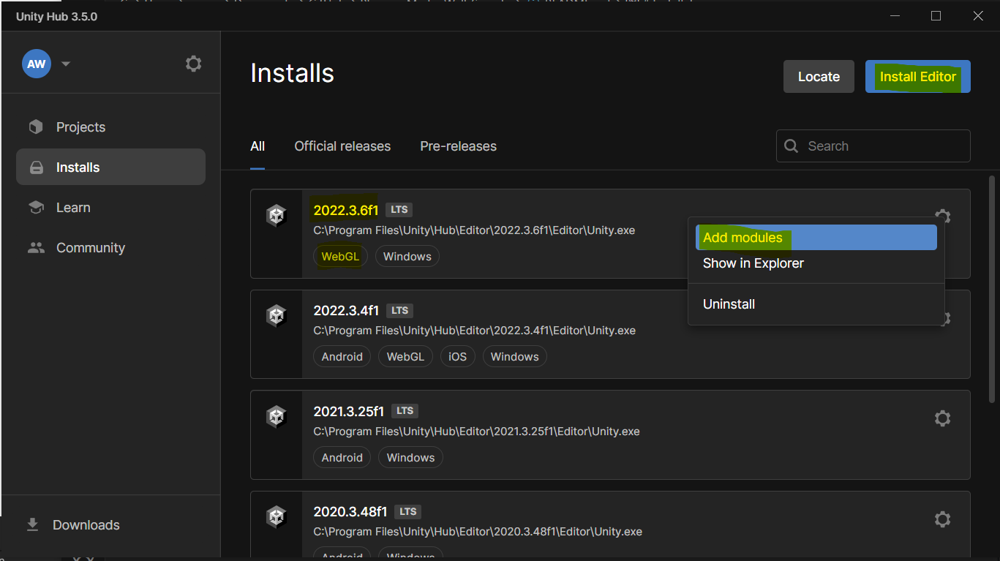
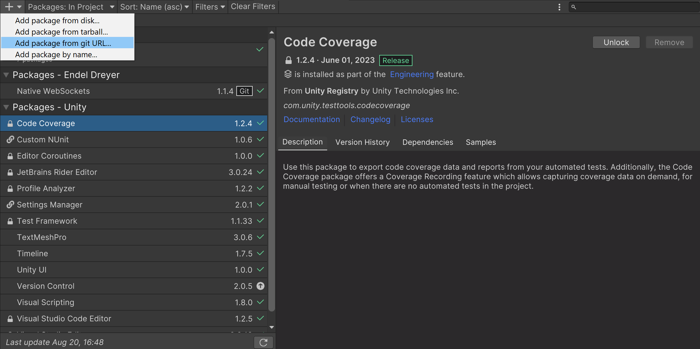
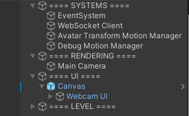
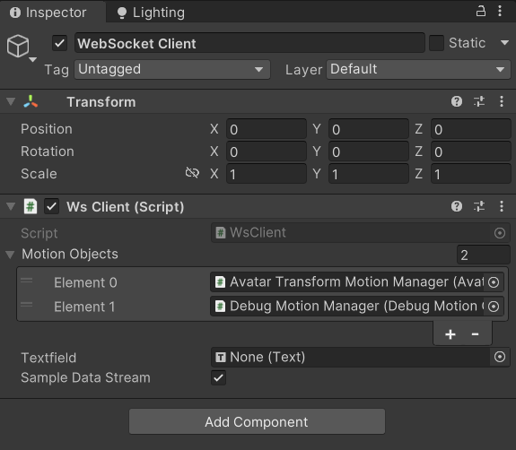
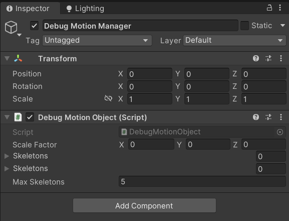
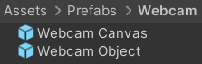
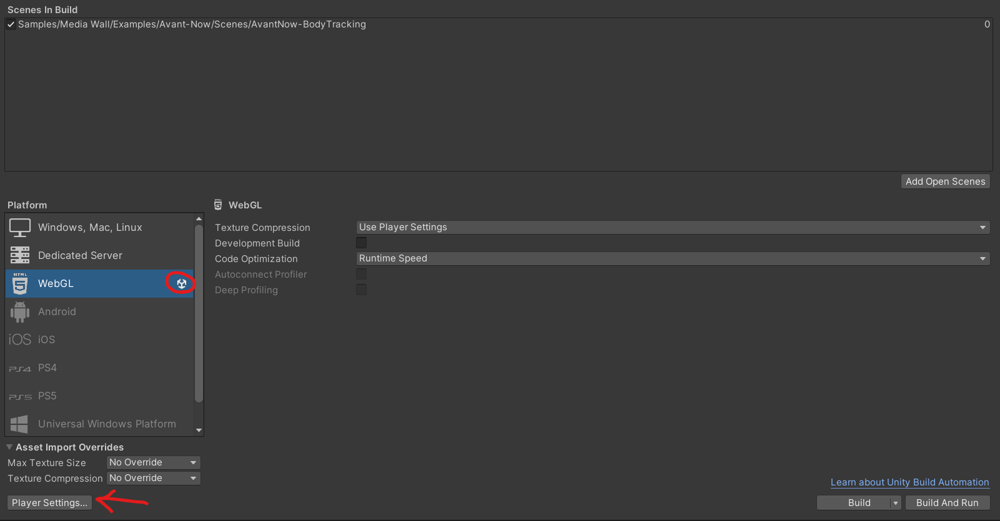
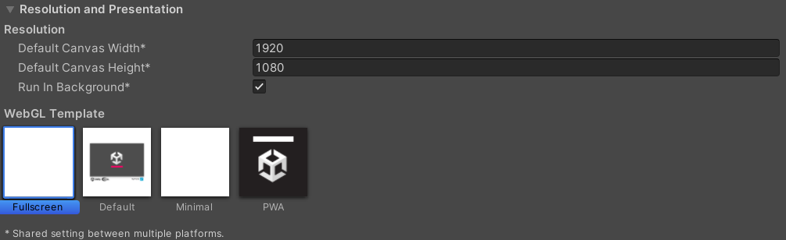
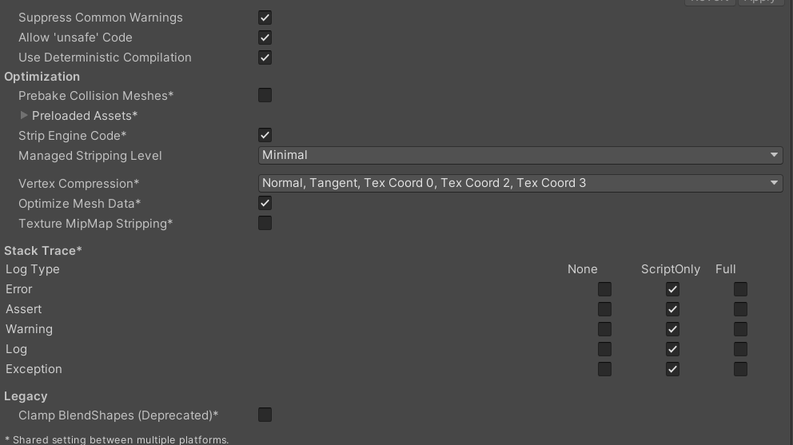
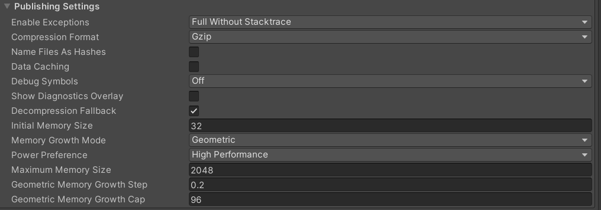

# Introduction

This project is designed to assist artists with creating content for the media wall at Phoenix Cinema and Arts Centre, Leicester, UK. They are split into two sections, the Unity 2022(LTS) Sample, and the Unity 2022(LTS) Template. You can find the documentation for the Javascript web sample here: https://github.com/PhoenixDigiArt/media-wall-webapp-sample.

In this repository, there are two options for your project, the Media-Wall Sample source code and the Media Wall Package (Found in the GitHub repository Releases page), and as the name suggests, the sample includes sample scenes with custom code. In contrast, the package installs the required functionality into your own project.

This document should be used as a guide on using the Media-Wall plugin for Unity, which can be downloaded as a Unity Package file from the repository releases page. To learn about Unity, please refer to the Unity Learn and Unity Documentation web pages for guidance.

### Recommendations

The Phoenix-Media-Wall package was built for Unity version 2022(LTS) and it is recommended that you use this version. All other Unity versions are untested and there may be unexpected errors with no documented solutions if you choose to use a different Unity build.

The bodytracking in this sample expects the 3D model used to have a humanoid skeleton. https://www.mixamo.com/ is an excellent resource for downloading pre-rigged models for free, and it also has a tool for automated rigging.

# Installation

To install this package, it is necessary to install WebGL support to your Unity installation. Either Install Unity2022(LTS) with the WebGL module in the Unity Hub launcher, or update your current installation of Unity2022(LTS) to include the WebGL module.

If you are using Unity 2022, but the subversion isn't 2022.3.6f1, they you will still be prompted before launching about whether you want to change the project version. This is okay, as long as you are using a 2022(LTS) version it should work. LTS means Long-Term support, so the version receives regular bug fixes that shouldn't effect the package.

### Dependancies

The Unity Project depends on the Native Websocket API package by Endal on GitHub, this package can be added to your project using the Unity Package Manager. Open the Package Manager window, Press the + in the upper left and click and from Git URL. The URL is: https://github.com/endel/NativeWebSocket.git#upm

### Adding the Media Wall Package to your project

Visit the releases page on the GitHub repository and download the latest stable release. Open your Unity 2022(LTS) project (or create a new one), and then drag the package into the Project window. You will then be asked to import all of the contents. Once imported, all the necessary scripts will be in your project, however you may have to manually add Native Web Sockets by Endel, which can be done by following the prior instructions.

### Opening the Media Wall Sample

Either use Git to clone the repository or download the source code from the Github page. Once downloaded, open Unity Hub and open the Media-Wall Sample project in Unity2022(LTS) with WebGL support.

### Creating a bodytracking scene

Once the package is installed, you need to create a scene to set-up the bodytacking. First create and open a new scene and create an empty object. Name this empty object 'Systems'. This object will be the parent for all the important systems required. The image below is an example of an organised Hierarchy for a media-wall project.

Under the 'Systems' object (Name is unnecessary, call it what you want), create a new gameobject as a child. This should be named 'WebSocket Client', as once the WsClient script is added, this object will handle updating all the relevent scripts that require the bodytracking data.

The websocket client class has a list of 'Motion Objects', these are the different types of classes that use the motion data provided by the media-wall bodytracking data. In the image above, we can see the scene has two motion object renderers, one for the debug data and one to animate a character avatar. This is done to compare the data between the complex character and the raw data. More information on motion objects can be found below.

There is also the option to add a text object, this simply reads out the data and applies it to a text element, and it can be left empty if undesired.

Finally, there is the Sample Data Stream button. If checked, the Ws Client will instantiate a class that transmits sample data. This is to enable development remotely with no access to the live bodytracking. If the WsClient loads the sample data, the project has to reload to connect to the genuine connection.

# Quick-Start Guide

Once you have your scene set-up, you are free to use Unity to develop your scene. Make sure you develop everything to work with the WebGL player of Unity, as it has different requirements to standalone development. The Unity Documentation and Forums have extensive resources on what can and can't be done in WebGL. To access the bodytracking data, you have to create a gameobject with an instance of the Motion Object class, and include it in the WsClient's list of game objects.

### Motion Object

The Motion Object class reads the bodytracking data and instantiates a Skeleton for each collection of joints in the data. If multiple Motion Objects are referenced in the WsClient, the Skeletons will be duplicated for each system.

The Motion Object class on its own is fairly useless, however several classes inherit from it and override some functions.

By overriding the `protected virtual void UpdateMotionObject()` class. An example of this can be found in the DebugMotionObject class, which instantiates cubes and spheres at each joint position and updates every frame.

Either use one of the following classes that overrides Motion Object, or create your own. It is not recommended to edit any of the scripts in this package, and if you need to do so, it is recommended to instead copy a script and rename it via file name and class definition. Then you can make any tweaks you like without damaging the code base.

#### Debug Skeletons

The debug motion object class in this package creates simple gameobjects to represent the bodytracking data. Once added to the Websocket Client Motion Objects array, the Debug Motion Object class will instantiate each skeleton in the bodytracking data. This is useful as a comparison tool to ensure that the bodytracking data is being accurately represented. (Tip: Rendering your character as 50% transparent in the material properties allows you to see the debug skeleton joints when they render inside the character body)

#### AvatarIK skeleton

#### AvatarTransform Skeleton

#### Webcam Passthrough

To add the webcam footage to your scene, either as a fullscreen UI element or as a 3d object in the world space, either drag either the Canvas or Object prefabs from Assets/Prefabs/Webcam, or Create an object with either a renderer or a UI raw image and attach the Webcam Controller script.

### Building for web

First, open the build settings window and ensure that WebGL is the selected platform. Also, include the scene you want the WebGL player to open and add it to the list of Scenes to build. Once completed, select 'Player Settings...'.

Once in the player settings, there is a bunch of build settings. Check the Unity Docs for how to set up things like your own logo on the splash screen, or your company name in the metadata. However, the following is necessary;

Under Icon, set the resolution to 1920x1080, Select run in background, and select the custom fullscreen template that is included in the project.

Under Other settings, Reduce the stripping level, allow 'unsafe' code, and overall match the settings to the image below.

Finally, in publishing settings, set Enable Exceptions to Full without Stacktrace, the Compression format to Gzip, turn off Data caching, and enable the Decompression Fallback.

If all is done correctly, 'build and run' will create a Html webpage that when hosted, will load your scene and play. On the media wall it will access the websocket and collect the motion data. It is recommended to leave sample data stream on so this can be tested on your own machine.

Hint: The WebGL player will only work when hosted, so it shouldn't work by double click. Github Pages is a really simple way to host your webpage.
